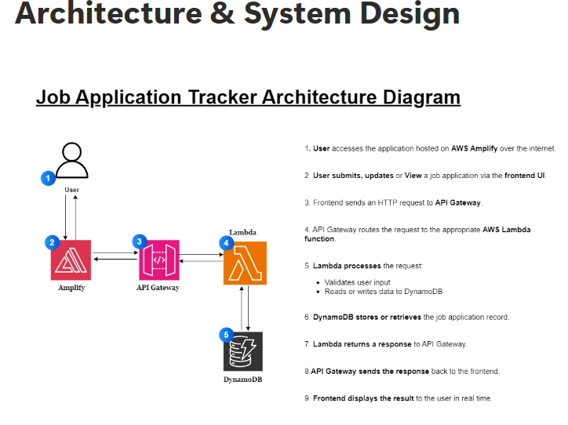

# Job Application Tracker

A modern, responsive web application for tracking job applications with a beautiful horizontal scrolling carousel interface.

**Built with guidance from [TechByEdwina](https://www.linkedin.com/company/techbyedwina/) - AWS Accredited Instructor**

## Features

- **Comprehensive Application Form** - Track company, role, status, source, dates, salary, actions, and notes
- **Horizontal Scrolling Carousel** - Beautiful card-based UI with smooth horizontal scrolling
- **Navigation Controls** - Previous/Next buttons and dot indicators for easy navigation
- **Touch/Swipe Support** - Mobile-friendly swipe gestures for carousel navigation
- **Smart Filtering** - Filter applications by status (All, Applied, Interviews, Awaiting, Offers, Hired)
- **Custom Status & Source** - Add your own custom statuses and application sources
- **Salary Tracking** - Track salary ranges for each application
- **Fully Responsive** - Perfect experience on desktop, tablet, and mobile
- **Real-time Updates** - Instant UI updates with loading states
- **Interactive Elements** - Hover effects, animations, and smooth transitions
- **Toast Notifications** - User-friendly feedback for all actions
- **Form Validation** - Required field validation with helpful messages

## Tech Stack

**Frontend:**
- HTML5 with semantic markup
- CSS3 with modern features (Grid, Flexbox, Gradients, Animations)
- Vanilla JavaScript (ES6+) with async/await and touch events

**Backend:**
- AWS Lambda (Python)
- Amazon DynamoDB
- Amazon API Gateway

## Getting Started

### Prerequisites
- AWS Account
- Basic knowledge of AWS services (Lambda, DynamoDB, API Gateway)

### Backend Setup
1. **Create DynamoDB Table:**
   - Table name: `job-applications`
   - Partition key: `applicationId` (String)

2. **Deploy Lambda Function:**
   ```python
   import json
   import uuid
   import boto3
   import os
   from datetime import datetime

   dynamodb = boto3.resource('dynamodb')
   table = dynamodb.Table(os.environ['TABLE_NAME'])

   def lambda_handler(event, context):
       # Detect invocation source
       if "requestContext" in event and "http" in event["requestContext"]:
           method = event["requestContext"]["http"]["method"]
       else:
           # Local / console test fallback
           method = event.get("httpMethod", "GET")

       now = datetime.utcnow().isoformat()

       # Handle CORS preflight
       if method == "OPTIONS":
           return cors_response(200, "")

       if method == "POST":
           body = json.loads(event.get("body", "{}"))
           item = body.copy()
           item["applicationId"] = str(uuid.uuid4())
           item["createdAt"] = now
           item["lastUpdated"] = now
           table.put_item(Item=item)
           return cors_response(201, item)

       if method == "GET":
           response = table.scan()
           return cors_response(200, response["Items"])

       return cors_response(400, {"message": "Unsupported HTTP method"})

   def cors_response(status_code, body):
       return {
           "statusCode": status_code,
           "headers": {
               "Access-Control-Allow-Origin": "*",
               "Access-Control-Allow-Methods": "GET,POST,OPTIONS",
               "Access-Control-Allow-Headers": "Content-Type"
           },
           "body": json.dumps(body)
       }
   ```

3. **Create API Gateway:**
   - Create HTTP API
   - Add routes: `GET /applications` and `POST /applications`
   - Connect to Lambda function
   - Enable CORS

4. **Frontend Configuration:**
   - API Gateway endpoint is already configured in `app.js`
   - The app will connect to the same backend as the main version

### Frontend Deployment

#### AWS Amplify (Recommended)
1. Connect your repository to AWS Amplify
2. Amplify will automatically detect this as a static site
3. Deploy with default settings

#### Other Static Hosts
- **Netlify**: Drag and drop the files
- **Vercel**: Connect repository or upload files
- **GitHub Pages**: Push to repository and enable Pages

## File Structure

```
├── index.html          # Main HTML with carousel structure
├── app.js             # JavaScript with carousel and touch functionality
├── styles.css         # Modern CSS with carousel animations
└── README.md          # This file
```

## Application Fields

The app tracks the following information for each application:
- **Company Name** (required)
- **Job Title** (required)
- **Application Status** (with custom option)
- **Application Source** (with custom option)
- **Location**
- **Date Applied**
- **Salary Range**
- **Next Action**
- **Notes**

## DynamoDB Schema

The Lambda function automatically adds:
- `applicationId` - Unique identifier (UUID)
- `createdAt` - Timestamp when created
- `lastUpdated` - Timestamp when last modified

## Carousel Features

- **Smooth Scrolling** - Buttery smooth horizontal scrolling animation
- **Responsive Cards** - Cards adapt to different screen sizes (3 on desktop, 2 on tablet, 1 on mobile)
- **Navigation Controls** - Previous/Next buttons with disabled states
- **Dot Indicators** - Visual dots showing current position and total slides
- **Touch Support** - Swipe left/right on mobile devices
- **Auto-hide Controls** - Navigation buttons hide when not needed




## End-to-End Flow

1. User opens the frontend web app hosted on **AWS Amplify**
2. User action (create/read/update application record) triggers an **HTTPS request** to **Amazon API Gateway**
3. API Gateway routes the request to the appropriate **AWS Lambda** function
4. Lambda executes the business logic (validate input, format data)
5. Lambda performs a **read or write operation** on **Amazon DynamoDB**
6. DynamoDB returns the result to Lambda
7. Lambda formats the response and returns it to API Gateway
8. API Gateway sends the HTTP response back to Amplify frontend
9. Frontend updates the UI with the result
10. **AWS IAM** enforces least-privilege permissions between Lambda and DynamoDB throughout

## Key Points

- Why Lambda instead of EC2? Serverless = no server management, scales automatically, pay-per-use
- Why DynamoDB? Schema-less, fast key-value lookups, perfect for CRUD at this scale
- Why API Gateway as the entry point? It decouples the frontend from the backend, handles auth, rate limiting, and routing
- IAM is not optional — always show it in diagrams even if it's invisible during operation

## Browser Support

- Chrome 60+
- Firefox 55+
- Safari 12+
- Edge 79+

## Mobile Experience

Optimized mobile experience with:
- Touch-friendly swipe gestures
- Responsive card sizing
- Mobile-optimized navigation buttons
- Touch-friendly forms and buttons

## Customization

Easy to customize:
- Adjust cards per view in JavaScript
- Change gradient colors in CSS
- Modify status badge colors
- Adjust carousel timing and animations
- Add new form fields

## Learning Outcomes

This project demonstrates:
- **Frontend Development** - Modern HTML, CSS, and JavaScript
- **AWS Services Integration** - Lambda, DynamoDB, API Gateway
- **Responsive Design** - Mobile-first approach
- **User Experience** - Interactive carousel and smooth animations
- **Error Handling** - Proper error states and user feedback
- **Form Validation** - Client-side validation and user input handling
- **API Integration** - RESTful API consumption
- **Modern CSS** - Gradients, animations, and flexbox/grid layouts

## License

MIT License - Perfect for personal, educational, or portfolio projects!

---

*This project was built with guidance from TechByEdwina, helping developers create real-world AWS applications that showcase job-ready skills.*
